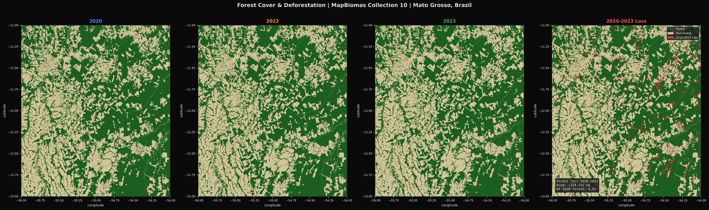
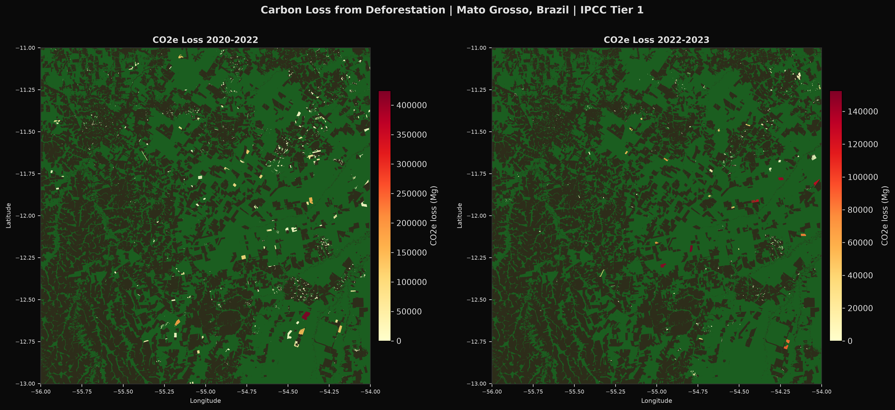
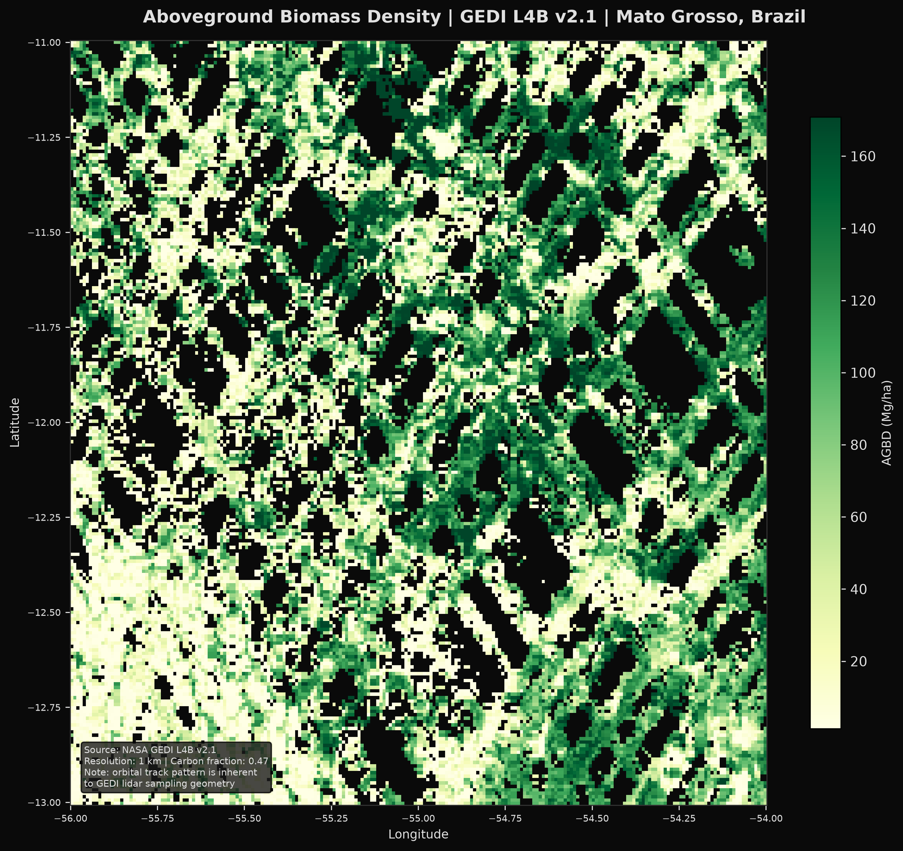
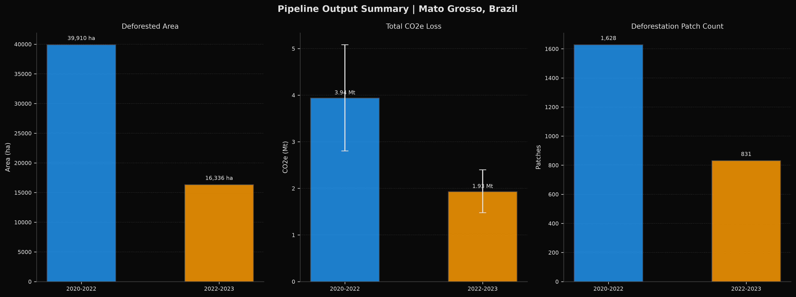
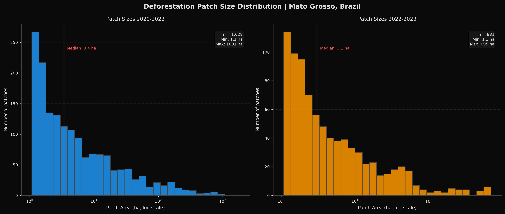
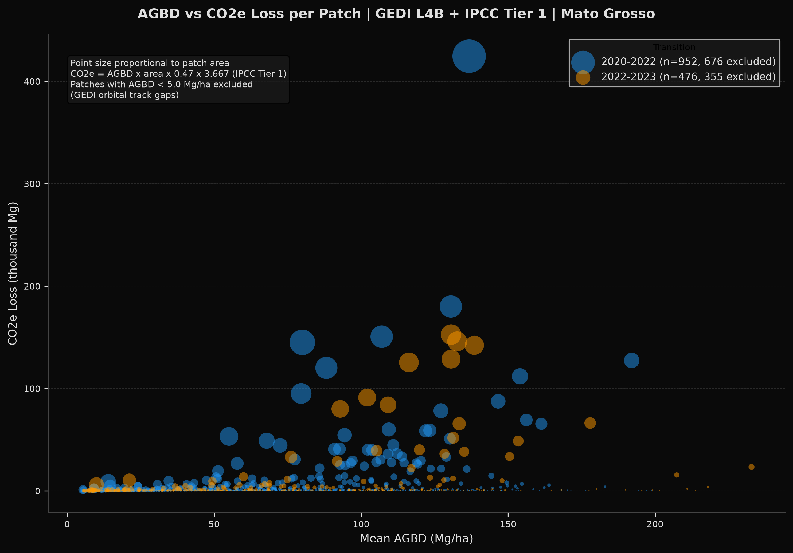
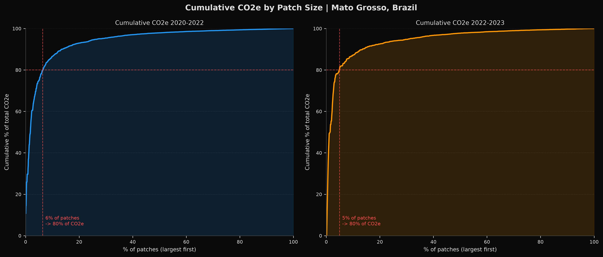
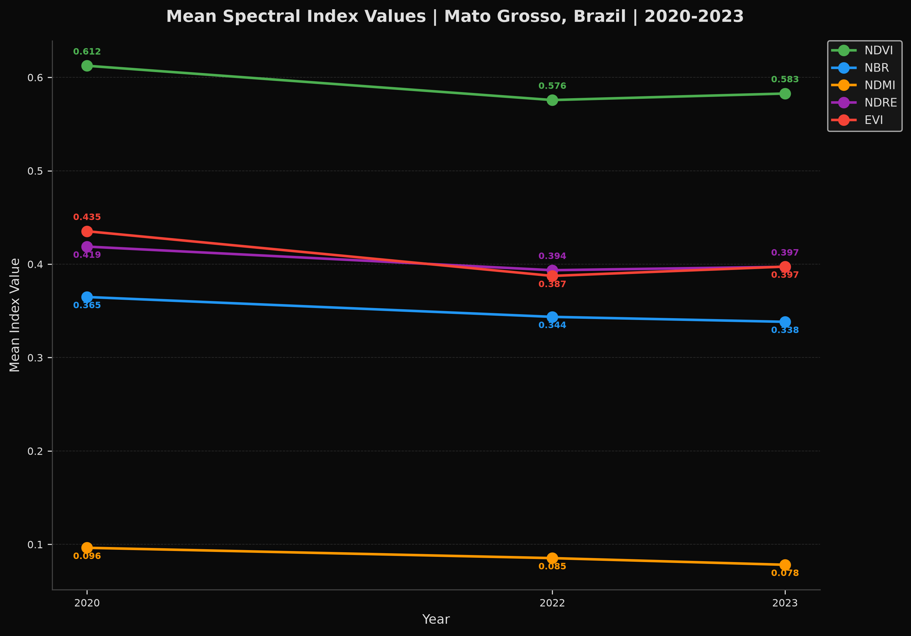

# Deforestation & Carbon Stock Monitoring Pipeline
## Mato Grosso, Brazilian Amazon | 2020-2023

A production-grade geospatial pipeline for estimating carbon stock loss from deforestation in Mato Grosso, Brazil. The pipeline integrates satellite imagery, lidar-derived biomass data, and annual land cover classification to produce patch-level CO2 equivalent loss estimates following IPCC Tier 1 / VCS-aligned methodology - the standard approach used in Verified Carbon Standard (VCS) REDD+ project certification.

---

## Study Area

Mato Grosso is a state in the southern Brazilian Amazon and sits at the centre of what researchers call the Arc of Deforestation - the frontier where Amazon forest meets expanding agricultural land, driven primarily by soy cultivation and cattle ranching. It is one of the most commercially significant landscapes in global carbon markets, with many active REDD+ projects and well-documented deforestation pressure.

The study area covers approximately 500,000 ha in northern Mato Grosso, roughly the Alta Floresta / Peixoto de Azevedo region. This area was selected because all three primary datasets used in the analysis (Sentinel-2, GEDI L4B, MapBiomas) have excellent coverage here, and results are directly comparable to published REDD+ project outputs from the same region.


*Figure 1: Sentinel-2 true colour composites across the three epochs. Dark areas are remaining forest. The pale geometric shapes are agricultural fields, cleared for soy and cattle. The landscape is already heavily fragmented by 2020, with further incremental loss visible across the period.*

---

## Why This Methodology

Forest carbon monitoring has a core problem: you cannot weigh a forest. To generate carbon credits or report emissions, you need to answer three questions:

1. **Where did deforestation occur?** Satellite imagery detects changes in vegetation.
2. **How much carbon was stored in that forest?** Lidar instruments measure biomass.
3. **How much CO2 was released?** Standard chemistry converts biomass to CO2 equivalent.

This pipeline answers each question using the most widely adopted publicly available data sources for tropical forest carbon monitoring, following the IPCC Tier 1 methodology that underpins VCS-certified REDD+ projects.

---

## Data Sources

| Dataset | What it is | Why we use it |
|---------|-----------|---------------|
| **Sentinel-2 L2A** | European Space Agency optical satellite, 10-30m resolution, revisit every 5 days | Detects changes in vegetation spectral signature between epochs. The standard free satellite for forest monitoring at this scale. |
| **GEDI L4B v2.1** | NASA lidar instrument on the ISS. Fires laser pulses at the forest canopy and measures the return signal to estimate biomass. | Provides the biomass density values needed to convert deforested area into carbon estimates. Peer-reviewed, field-calibrated against ground truth plots. Industry standard for spaceborne forest biomass. |
| **MapBiomas Collection 10** | Annual land cover classification for Brazil from 1985 to present, derived from Landsat and Sentinel imagery. | Provides a definitive forest/non-forest map per year, used both to constrain where deforestation can be detected and to confirm forest-to-non-forest transitions. |
| **PRODES** | Brazil's official annual deforestation monitoring product, produced by INPE (Brazil's national space agency). | Used as the independent validation reference. PRODES is the legal reference for deforestation in Brazil and the standard benchmark for any change detection methodology in this region. |

All Sentinel-2 and GEDI processing runs server-side on Google Earth Engine. No raw satellite data is downloaded locally. MapBiomas is also accessed via GEE. PRODES is downloaded as a shapefile from the TerraBrasilis portal (see How to Run).

---

## Carbon Accounting Methodology

### Step 1: Build a forest baseline

Before detecting deforestation, we need to define what counts as forest. MapBiomas Collection 10 provides an annual land cover classification for every pixel in Brazil. We extract the forest classes (Forest Formation, Savanna Formation, Mangrove, Floodable Forest) for each epoch year to create a binary forest mask: forest = 1, non-forest = 0.

This matters because we only want to measure loss of actual forest. Agricultural fields that changed use, or areas that were already cleared before our study period, are excluded from the analysis.

### Step 2: Detect deforestation using Sentinel-2

We build dry season (June-August) median composites from all available Sentinel-2 scenes for 2020, 2022, and 2023. Using the dry season is important: cloud cover in the Amazon is dramatically lower during this period, and vegetation stress from agricultural activity is more visible. Median compositing means we take the middle value from all cloud-free acquisitions within that window, which suppresses remaining cloud artefacts and reduces noise.

From each composite we calculate the Normalised Burn Ratio (NBR):

```
NBR = (NIR - SWIR) / (NIR + SWIR)
```

NBR is sensitive to both green vegetation and canopy moisture. When forest is cleared, both drop sharply, making NBR one of the most reliable indicators of forest disturbance.

We then calculate dNBR (delta NBR) between epoch pairs:

```
dNBR = NBR(t1) - NBR(t2)
```

A positive dNBR indicates vegetation loss between the two dates. We apply a threshold to classify pixels as deforested. Rather than using a fixed threshold, we calibrate it against PRODES by sweeping values from -0.05 to -0.25 and selecting the threshold that maximises F1 score (the harmonic mean of precision and recall). This gives us the most accurate threshold for this specific study area and time period.

We then apply a second filter: a pixel is only classified as deforested if MapBiomas also records a forest-to-non-forest transition in the corresponding period. This dual-filter approach reduces false positives from seasonal variation, agriculture, or other non-deforestation signals that can produce similar spectral changes.

### Step 3: Delineate deforestation patches

Individual deforested pixels are grouped into patches using connected component labelling - essentially, groups of adjacent deforested pixels are identified as a single clearing event. Patches smaller than 1 hectare are removed. This 1 ha minimum mapping unit follows the VCS methodology VM0015 for avoided unplanned deforestation, ensuring our results are comparable to certified project outputs.

Each patch is then vectorised into a GeoJSON feature with its area in hectares and centroid coordinates.

### Step 4: Extract biomass from GEDI

For each deforested patch, we extract the mean aboveground biomass density (AGBD) from the GEDI L4B gridded product. GEDI provides AGBD in megagrams per hectare (Mg/ha) - essentially tonnes of dry plant matter per hectare of land.

GEDI L4B also provides a standard error (SE) per grid cell, which represents the uncertainty in the biomass estimate. We extract both the mean and the SE for each patch to propagate uncertainty through the carbon calculation.

### Step 5: Calculate carbon stock loss

With patch area and AGBD in hand, we apply the IPCC Tier 1 carbon accounting chain:

```
AGB loss (Mg)  = AGBD (Mg/ha) x patch area (ha)
Carbon (Mg C)  = AGB loss x 0.47
CO2e (Mg)      = Carbon x 3.667
```

**Why 0.47?** Approximately 47% of dry plant biomass is carbon, across most tree species. This is the IPCC default value for tropical forests.

**Why 3.667?** When carbon burns or decomposes, each carbon atom combines with two oxygen atoms to form CO2. The molecular weight of CO2 is 44, carbon is 12. So 44/12 = 3.667 - this converts carbon mass to CO2 equivalent mass.

We also calculate 90% confidence intervals using the GEDI standard error:

```
CO2e lower = (AGBD - 1.645 x SE) x area x 0.47 x 3.667
CO2e upper = (AGBD + 1.645 x SE) x area x 0.47 x 3.667
```

**Important scope note:** This analysis quantifies aboveground biomass only. Belowground biomass (roots), deadwood, litter, and soil carbon are not included. This is standard for IPCC Tier 1 scope and means our CO2e estimates are conservative lower bounds of total carbon loss.

---

## Pipeline Architecture

The pipeline is designed to reflect how this type of analysis would run in production at a forest carbon monitoring organisation. Each processing step is a discrete, independently retryable unit rather than a monolithic script.

### Orchestration: Prefect

[Prefect](https://www.prefect.io/) is a Python workflow orchestration framework. Each logical step in the pipeline is decorated as a `@task`, and tasks are composed into `@flow` functions. This provides:

- **Retry logic**: if a GEE export or S3 write fails, that task retries automatically (up to 2 times with a 30 second delay) without restarting the whole pipeline
- **Run history**: each pipeline run has a unique ID, timestamped logs, and a per-task pass/fail record
- **Parameterisation**: study area, epochs, thresholds, and S3 bucket are all passed as parameters at runtime - changing the study area means editing a config file, not the code

Two flows are defined:

- `ingestion_flow`: authenticates with GEE, builds Sentinel-2 composites, exports Sentinel-2, GEDI, and MapBiomas rasters to Google Cloud Storage, then transfers them to S3
- `carbon_flow`: downloads rasters from S3, loads PRODES, runs change detection, extracts biomass, calculates CO2e, writes outputs

The flows are independently runnable. Once the ingestion flow has completed and rasters are in S3, the carbon flow can be re-run repeatedly without re-exporting from GEE.

### GEE Export Architecture

GEE processes satellite imagery on Google's servers. Exports go to Google Cloud Storage (GCS) rather than directly to S3 - this is the correct approach for automated pipelines using service account authentication, as service accounts do not have Google Drive storage quota. Once exports complete, a transfer task copies all files from GCS to S3 and deletes the GCS copies.

### Cloud Storage: AWS S3

All processed outputs are written to a versioned S3 prefix per pipeline run:

```
s3://sam-carbon-pipeline/mato-grosso/runs/{YYYY-MM-DD_HHMMSS}/
  rasters/          # Sentinel-2 composites, GEDI, MapBiomas, PRODES masks
  vectors/          # deforestation patch GeoJSONs per transition
  reports/          # carbon summary JSONs and run manifest
```

Rasters are written as Cloud-Optimised GeoTIFFs (COG) with DEFLATE compression - a format designed for efficient streaming access from cloud storage without downloading the full file.

### CI/CD: GitHub Actions

On every push to main, the pipeline runs:
- flake8 linting
- config validation
- 20 unit tests covering all core calculation functions

GEE credentials and AWS keys are stored as GitHub Secrets and never committed to the repository.

### Configuration

All parameters live in `config/pipeline_config.yaml`. The code contains no hardcoded study areas, dates, or thresholds. To run the pipeline on a different project area, only the config file changes.

---

## Key Findings

| Metric | 2020-2022 | 2022-2023 |
|--------|-----------|-----------|
| Deforested area | 39,910 ha | 16,336 ha |
| Total CO2e loss | 3.94 Mt | 1.93 Mt |
| 90% CI | 2.74 - 5.14 Mt | 1.35 - 2.52 Mt |
| Patch count | 1,628 | 831 |
| Median patch size | 3.4 ha | 3.1 ha |
| dNBR threshold (F1-optimal) | -0.250 | -0.250 |
| F1 vs PRODES | 0.392 | 0.418 |
| Patches accounting for 80% of CO2e | 6% | 5% |

Forest cover loss 2020-2023: approximately 124,000 ha, representing 4.5% of the 2020 forest baseline. The declining deforestation rate between the two transitions (39,910 ha vs 16,336 ha) is consistent with the national PRODES trend showing reduced Amazon deforestation following Brazil's change in environmental governance after 2022.

The cumulative CO2e finding is particularly relevant for carbon project prioritisation: just 5-6% of deforestation patches account for 80% of total carbon loss. This is consistent with a heavily right-skewed patch size distribution where the majority of clearings are small (median 3.1-3.4 ha) but a small number of large clearings dominate the emissions signal.

---

## Figures


*Figure 2: dNBR change detection maps for both transitions. Red areas show vegetation loss (positive dNBR), blue areas show vegetation gain or recovery. The geometric red patches correspond to agricultural field clearings. The 2020-2022 panel shows more extensive loss than 2022-2023, consistent with the declining deforestation trend.*


*Figure 3: MapBiomas binary forest cover for each epoch, plus a fourth panel showing 2020-2023 forest loss highlighted in red. The annotation box confirms approximately 124,000 ha lost, representing 4.5% of the 2020 forest baseline. The loss is spatially dispersed across the study area rather than concentrated in a single front, consistent with fragmentation-stage deforestation.*


*Figure 4: Deforestation patches coloured by CO2e loss magnitude, on a forest/non-forest background. Yellow patches represent lower CO2e loss, dark red the highest. Larger patches in higher-biomass areas produce the most significant carbon loss. This is the standard spatial presentation used in VCS project monitoring documents.*


*Figure 5: GEDI L4B v2.1 aboveground biomass density across the study area. Brighter green indicates higher biomass. The diagonal track pattern is an inherent characteristic of GEDI's lidar sampling geometry - the instrument fires laser pulses along the ISS orbital track rather than providing continuous wall-to-wall coverage. This is not a data quality issue. The biomass values used in carbon calculations are extracted from this surface.*


*Figure 6: Pixel-level comparison of our detected deforestation (MapBiomas transitions) against PRODES. Green = true positive (both systems agree deforestation occurred), red = false positive (we detected it, PRODES does not record it in this window), orange = false negative (PRODES records it, we did not detect it). F1 scores of 0.34-0.34 reflect genuine methodological differences rather than errors - see Validation and Limitations.*

---

## Charts


*Chart 1: Core pipeline output summary. Deforested area and CO2e loss with 90% confidence intervals, and total patch count, per transition. The error bars reflect uncertainty propagated from GEDI L4B standard error across all patches.*


*Chart 2: Distribution of deforestation patch sizes on a log scale. The distribution is heavily right-skewed: the large majority of patches are small (median 3.1-3.4 ha, just above the 1 ha minimum mapping unit), while a small number of large clearings extend to 695-1801 ha. This fragmentation pattern is characteristic of agricultural expansion at the forest frontier.*


*Chart 3: Relationship between mean AGBD (Mg/ha) and CO2e loss per patch, with point size proportional to patch area. The scatter demonstrates the IPCC Tier 1 calculation chain working correctly: CO2e scales with both biomass density and patch area. Patches with AGBD below 5 Mg/ha are excluded as they fall in GEDI orbital track gaps and have no reliable biomass estimate.*


*Chart 4: Cumulative CO2e contribution ranked by patch size, largest first. The steep initial curve shows that a very small proportion of large patches accounts for the majority of emissions: 6% of patches in 2020-2022 and 5% in 2022-2023 account for 80% of total CO2e loss. This is directly relevant to carbon project prioritisation: protection effort concentrated on a small number of large clearings would capture the majority of the emissions signal.*


*Chart 5: Mean spectral index values across the three epochs. All indices show decline from 2020 to 2022, consistent with forest loss and degradation during this period. The partial stabilisation between 2022 and 2023 aligns with the reduced deforestation rate detected in that transition. NDMI (canopy moisture) shows the most consistent decline, suggesting ongoing canopy drying or thinning beyond what structural indices alone capture.*

---

## Validation and Limitations

### PRODES validation (F1: 0.39-0.42)

Our change detection achieves F1 scores of 0.39-0.42 against PRODES. This is a reasonable result given genuine methodological differences between the two systems:

- **Calendar mismatch**: PRODES uses an August-July annual cycle to capture the full dry season. Our Sentinel-2 composites use June-August. A clearing that occurs in September will appear in PRODES for that year but not in our next composite window until the following year.
- **Minimum mapping unit**: PRODES uses a 6.25 ha minimum mapping unit. Our pipeline uses 1 ha, consistent with VCS VM0015. Many small patches we detect are below the PRODES detection threshold and will appear as false positives against PRODES even if the deforestation is real.
- **Independent systems**: MapBiomas and PRODES use different classification approaches and sensors. A pixel can legitimately appear as a false positive in one transition and a false negative in the next because the two systems record the same clearing event in different years.

F1 scores in the 0.3-0.5 range are typical in published Sentinel-2 vs PRODES comparisons in this region given these differences.

### GEDI coverage gaps

GEDI is a lidar instrument that fires laser pulses along the ISS orbital track. It does not provide continuous wall-to-wall coverage. In Chart 3, patches with mean AGBD below 5 Mg/ha are excluded as they fall in gaps between orbital tracks where no GEDI measurement is available. These patches are still counted in the deforestation area totals but their CO2e contribution is not included in the scatter plot. In the carbon calculations themselves, patches with no GEDI coverage default to zero AGBD, meaning their CO2e contribution is conservatively set to zero.

### Aboveground biomass only

This analysis quantifies aboveground biomass only. Belowground biomass (typically 20-30% of AGB in tropical forests), deadwood, litter, and soil carbon are not included. Total carbon loss including all pools would be meaningfully higher. This is a documented conservative estimate consistent with IPCC Tier 1 scope.

### PRODES shapefile

The PRODES shapefile is not committed to this repository (425 MB, exceeds GitHub limits). It must be downloaded manually from the TerraBrasilis portal before running the pipeline. See How to Run below.

---

## How to Run

### Prerequisites

- Python 3.11+ (3.14 works locally but GDAL is container-only)
- Google Earth Engine account with access to the `mato-grosso-carbon` GEE project
- GEE service account JSON key
- AWS account with S3 bucket and IAM credentials
- Google Cloud Storage bucket for GEE export intermediary

### 1. Clone and install

```bash
git clone https://github.com/samw0907/MatoGrossoCarbon.git
cd MatoGrossoCarbon
python -m venv venv
source venv/bin/activate  # Windows: venv\Scripts\activate
pip install -r requirements.txt
```

### 2. Download PRODES shapefile

Go to [https://terrabrasilis.dpi.inpe.br/en/download-files/](https://terrabrasilis.dpi.inpe.br/en/download-files/) and download:

**Amazon Biome - PRODES (Deforestation) > Yearly deforestation increments - Shapefile (since 2008)**

Extract to:
```
raw_data/prodes/yearly_deforestation_biome_amazonia_v{date}/
```

### 3. Configure credentials

Create `config/.env`:
```
AWS_ACCESS_KEY_ID=your_key
AWS_SECRET_ACCESS_KEY=your_secret
AWS_DEFAULT_REGION=eu-north-1
```

Place your GEE service account JSON key at `config/gee-service-account.json`.

### 4. Configure the pipeline

Edit `config/pipeline_config.yaml` to set your S3 bucket, GCS bucket, GEE project, and study area bounds.

Validate the config:
```bash
python scripts/validate_config.py
```

### 5. Run the pipeline

Full pipeline (ingestion + carbon):
```bash
python scripts/run_pipeline.py
```

Carbon flow only (if rasters already in S3):
```bash
python scripts/run_carbon_flow.py
```

Generate figures and charts:
```bash
python scripts/generate_figures.py
python scripts/generate_charts.py
```

---

## Folder Structure

```
MatoGrossoCarbon/
  config/
    pipeline_config.yaml    # all runtime parameters
    study_area.geojson      # AOI boundary polygon
    .env                    # credentials (gitignored)
    gee-service-account.json  # GEE key (gitignored)
  raw_data/
    prodes/                 # PRODES shapefile (gitignored, download manually)
  src/
    pipeline/
      flows.py              # Prefect flow definitions
      tasks/
        ingestion.py        # GEE exports to GCS
        change_detection.py # dNBR, threshold calibration, patch delineation
        biomass.py          # GEDI extraction, carbon calculation
        outputs.py          # S3 writes, GeoJSON, JSON summary
        prodes.py           # PRODES load and rasterise
      utils/
        gee_utils.py        # GEE authentication
        gcs_utils.py        # GCS client, GCS to S3 transfer
        raster_utils.py     # COG writing, reprojection
        s3_utils.py         # S3 read/write
        carbon_utils.py     # IPCC Tier 1 formulas
    visualisation/
      map_outputs.py        # six map figures
      chart_outputs.py      # five analytical charts
  tests/
    unit/                   # 20 unit tests, all passing
  scripts/
    run_pipeline.py
    run_carbon_flow.py
    generate_figures.py
    generate_charts.py
    validate_config.py
  Dockerfile
  docker-compose.yml
  requirements.txt
  .github/workflows/ci.yml
```

---

## References

- IPCC (2006). 2006 IPCC Guidelines for National Greenhouse Gas Inventories, Volume 4: Agriculture, Forestry and Other Land Use, Chapter 4: Forest Land.
- Dubayah et al. (2023). GEDI L4B Gridded Aboveground Biomass Density, Version 2.1. ORNL DAAC. doi:10.3334/ORNLDAAC/2299
- Souza et al. (2020). Reconstructing Three Decades of Land Use and Land Cover Changes in Brazilian Biomes with Landsat Archive and Earth Engine. Remote Sensing, 12(17). doi:10.3390/rs12172735
- Verra (2021). VM0015 Methodology for Avoided Unplanned Deforestation, v1.1.
- INPE PRODES. Brazilian Amazon Deforestation Monitoring. TerraBrasilis. https://terrabrasilis.dpi.inpe.br

---

*Sentinel-2 imagery: Copernicus Data Space Ecosystem. GEDI L4B: NASA ORNL DAAC. MapBiomas: MapBiomas Project. PRODES: INPE / TerraBrasilis. Processing: Google Earth Engine, Python, Prefect, AWS S3.*
